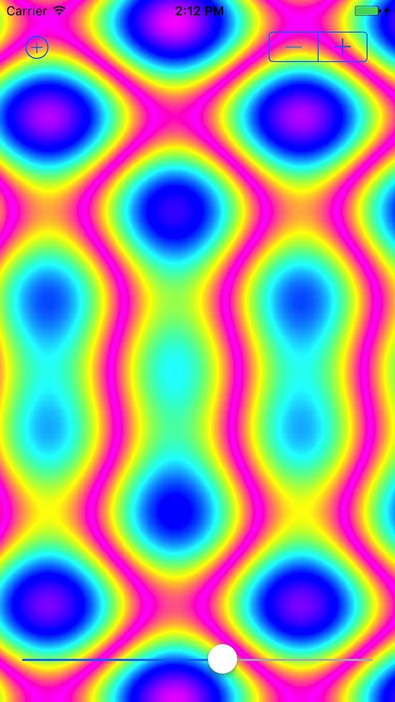
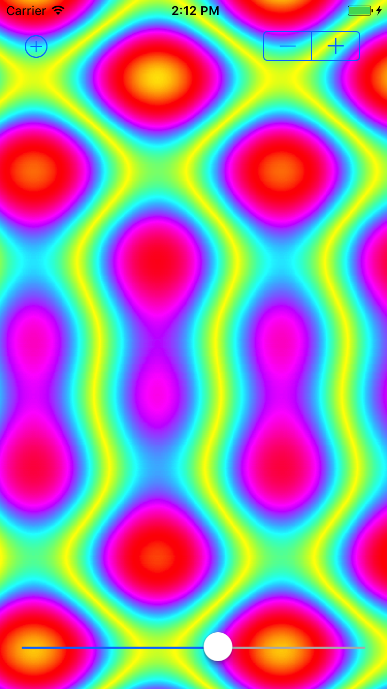
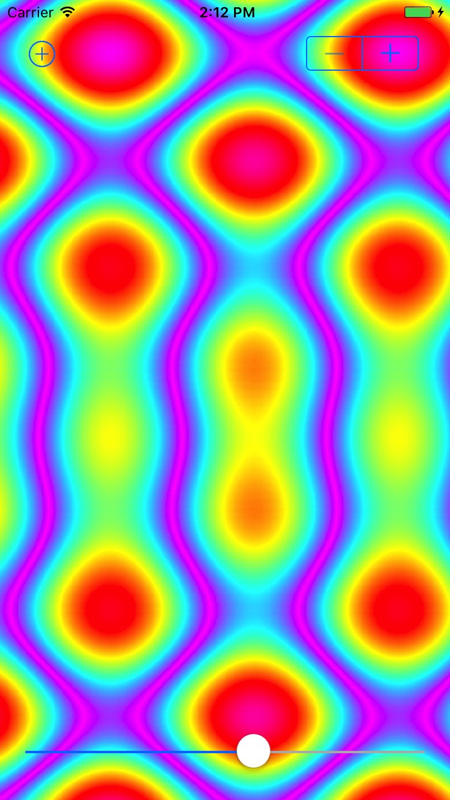
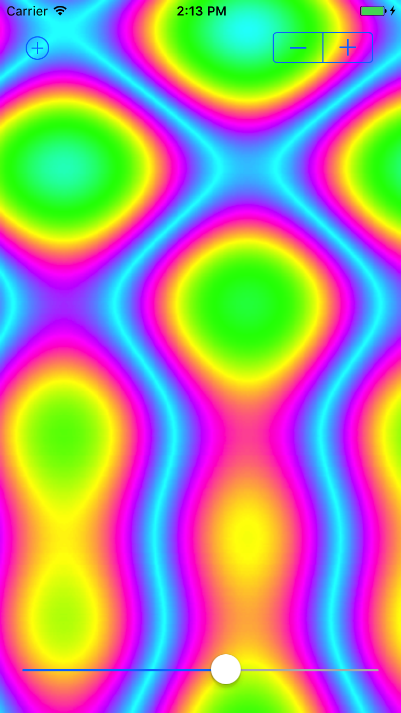

# Bitmap Plasma - iOS Demo

This is the iOS version of the original Android NDK's Bitmap Plasma C/C++ library, which can be found at:
https://github.com/googlesamples/android-ndk/tree/master/bitmap-plasma

## Screenshots
-----------

## Objectives:
1. Ability to reuse C/C++ library, across different platforms.
2. Ability to manipulate Bitmap's pixels on iOS's CGImage, UIImage, UIImageView...
3. Just have some fun.

## Modifications:
1. Supports both RGB565 and ARGB formats. The original one only works for RGB565.
2. Touch-interaction, switching Color Palettes...
3. Redesigned APIs to support cross-platforms.

## Requirements:
1. XCode 8.x
2. Swift 3
3. C/C++

## Improvements needed:
1. A better way to access to CGImage's bitmap-data directly.
2. GPU support.

## Any contribution is welcomed!
